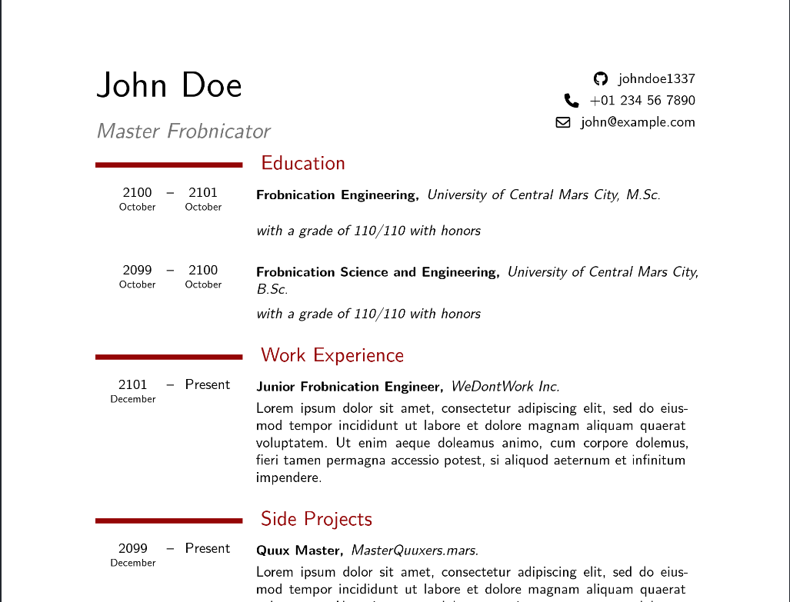

# ModernCV for Typst

* [How to use](#how-to-use)
* [Examples](#examples)



This is a [typst](https://github.com/typst/typst) template inspired by LaTeX's [moderncv](https://github.com/moderncv/moderncv).

Currently it features a very basic structure, but the main components are defined to allow for sufficient flexibility such to provide all the customizations that the original package has.

## How to use

This template provides a few customizations that should be considered when writing CVs:

* Headings:
  * `h1` for two-columns, coloured section headings
  * `h2` and `h3` used internally for job roles and places
  * `h4` usable as a generic heading by users
* Functions:
   * `cvcol`: used to write in the rightmost column only. Builds on `cvgrid`
   * `cventry`: used to write a CV entry. Builds on `cvgrid`
   * `cvlangauge`: used to write a language entry. Builds on `cvgrid`
   * `datebox`: provides content with stacked year above (big) and month below (tinier)
   * `daterange`: two `datebox`es separated by an em dash
   * `xdot`: adds a trailing dot to a string only if it's not already present
   * `cvgrid`: basic layout function that wraps a grid. Controlled by two parameters `left_column_size` (default: 25%) and `grid_column_gutter` (default: 8pt) which control the left column size and the column gutter respectively.


Most of the times you'll be using `cventry` and `cvcol`, for example:

```typst
= Work Experience

#cventry(
  start: (month: "December", year: 2101),
  end: (month: "", year: "Present"),
  role: [Junior Frobnication Engineer],
  place: "WeDontWork Inc.")[
    Your description here
]

#cvcol[
  ==== Generic stuff

  My other stuff goes here
]
```

## Examples

See `example.typ` `example.pdf`.
